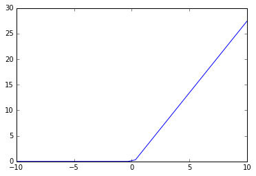
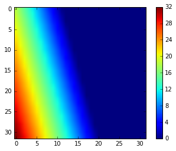
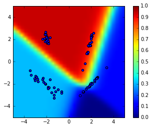

# Non Linearity Zoo


```python
from ipywidgets import interact
import ipywidgets as widgets
import matplotlib.pyplot as plt
%matplotlib inline
import numpy as np
```


## Sigmoid : $\, \, f(x) = e^{\left \langle w.x \right \rangle+b} \, \, w, x \in \mathbb{R}^N$
### One input variable


```python

def plot_sigmoid_1d(weight, bias):
    x = np.linspace(-5, 5, 32)
    y = 1/(1+np.exp(-(weight*x+bias)))
    plt.plot(x, y)

w= interactive(plot_sigmoid_1d, weight=(-5., 5.), bias=(-5., 5.));

```

    <ipywidgets.widgets.widget_box.Box object at 0x7f7a9b89abd0>


### Two input variables


```python
def plot_sigmoid_2d(weight1, weight2, bias):
    x = np.linspace(-5, 5, 32)
    y = np.linspace(-5, 5, 32)
    xv, yv = np.meshgrid(x, y)
    Z = 1/(1+np.exp(-(weight1*xv+weight2*yv+bias)))
    plt.imshow(Z)
    plt.colorbar()
    
interact(plot_sigmoid_2d, weight1=(-5., 5.), weight2=(-5., 5.), bias=(-5., 5.));
```


## The ReLU : $\, \, f(x) = max(x, 0)$
### One input variable


```python
def plot_sigmoid_1d(weight, bias):
    x = np.linspace(-5, 5, 32)
    y = np.maximum(weight*x+bias, 0)
    plt.plot(x, y)
    
interact(plot_sigmoid_1d, weight=(-5., 5.), bias=(-5., 5.));
```





### Two input variables


```python
def plot_relu_2d(weight1, weight2, bias):
    x = np.linspace(-5, 5, 32)
    y = np.linspace(-5, 5, 32)
    xv, yv = np.meshgrid(x, y)
    Z = np.maximum(weight1*xv+weight2*yv+bias, 0)
    plt.imshow(Z)
    plt.colorbar()
    
interact(plot_relu_2d, weight1=(-5., 5.), weight2=(-5., 5.), bias=(-5., 5.));
```





## 2D 2 Layer NN


```python
def sig(x):
    return 1/(1+np.exp(-x))

def nn(xv, yv, W, B):
    h1 = sig(W[0]*xv+W[1]*yv+B[0])
    h2 = sig(W[2]*xv+W[3]*yv+B[1])
    return sig(W[4]*h1+W[5]*h2+B[2])

def nn_score(X, W, B):
    out = nn(X[:,0], X[:,1], W, B)
    return np.mean(np.array(out>.5,dtype='float')==c)

from sklearn import datasets
X, c = datasets.make_classification(n_classes=2,class_sep=2.,random_state=22, n_samples=100, n_clusters_per_class=2, n_features=2, n_redundant=0, n_informative=2)
```


```python
def nn_2d(w1,w2,w3,w4,w5,w6,b1,b2,b3):
    W = [w1,w2,w3,w4,w5,w6]
    B = [b1,b2,b3]
    x = np.linspace(-5, 5,32)
    y = np.linspace(-5, 5,32)
    xv, yv = np.meshgrid(x, y)
    Z = nn(xv, yv, W, B)
    print('score = '+str(nn_score(X, W, B)))
    plt.scatter(X[:,0], X[:,1])
    ticks=np.linspace(-5, 5, 10)
    plt.imshow(Z,vmin=0, vmax=1, extent=[-5,5,-5,5], origin=True)
    plt.colorbar()

interact(nn_2d, w1=(-5., 5.), w2=(-5., 5.), w3=(-5., 5.), w4=(-5., 5.), w5=(-5., 5.), w6=(-5., 5.), b1=(-5., 5.), b2=(-5., 5.), b3=(-5., 5.));
```

    score = 1.0





```python

```
