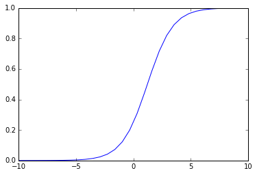
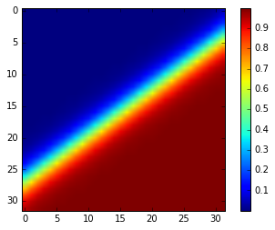

# Non Linearity Zoo

## Sigmoid : $\, \, f(x) = e^{\left \langle w.x \right \rangle+b} \, \, w, x \in \mathbb{R}^N$
### One input variable


```python
from ipywidgets import interact, interactive, fixed
import ipywidgets as widgets
import matplotlib.pyplot as plt
%matplotlib inline
import numpy as np

def plot_sigmoid_1d(weight, bias):
    x = np.linspace(-10, 10, 32)
    y = 1/(1+np.exp(-(weight*x+bias)))
    plt.plot(x, y)

interact(plot_sigmoid_1d, weight=(-5., 5.), bias=(-10., 10.));
```





### Two input variables


```python
def plot_sigmoid_2d(weight1, weight2, bias):
    x = np.linspace(-10, 10, 32)
    y = np.linspace(-10, 10, 32)
    xv, yv = np.meshgrid(x, y)
    Z = 1/(1+np.exp(-(weight1*xv+weight2*yv+bias)))
    plt.imshow(Z)
    plt.colorbar()
    
interact(plot_sigmoid_2d, weight1=(-5., 5.), weight2=(-5., 5.), bias=(-10., 10.));
```





## The ReLU : $\, \, f(x) = max(x, 0)$
### One input variable


```python
def plot_sigmoid_1d(weight, bias):
    x = np.linspace(-10, 10, 32)
    y = np.maximum(weight*x+bias, 0)
    plt.plot(x, y)
    
interact(plot_sigmoid_1d, weight=(-5., 5.), bias=(-10., 10.));
```


### Two input variables


```python
def plot_relu_2d(weight1, weight2, bias):
    x = np.linspace(-10, 10, 32)
    y = np.linspace(-10, 10, 32)
    xv, yv = np.meshgrid(x, y)
    Z = np.maximum(weight1*xv+weight2*yv+bias, 0)
    plt.imshow(Z)
    plt.colorbar()
    
interact(plot_relu_2d, weight1=(-5., 5.), weight2=(-5., 5.), bias=(-10., 10.));
```


